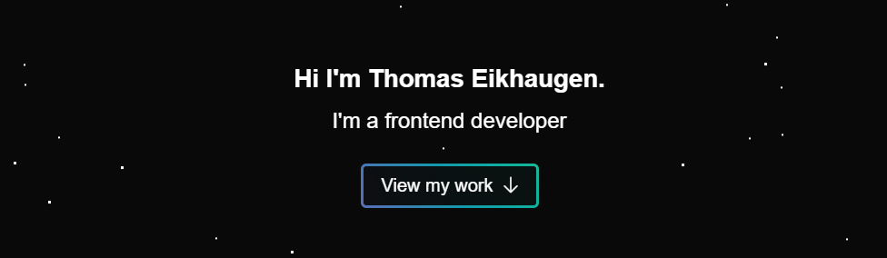

# Portfolio



This is my portfolio, made after the first year of Frontend Development at Noroff School of Technology and Digital Media.

## Table of contents:
- [Description](#description)
    - [Features](#features)
    - [Built with](#built-with)
- [Installing](#installing)
    - [Running](#running)
- [Contact](#contact)

## Description

This is my portfolio showcasing some of the projects I have made.

### Features:
- The website is responsive.
- Three projects are showcased:
  - Project 1 - [Innovatech Solutions Blog.](https://github.com/Eikhaugen/FED1-Project-Exam-1)
  - Project 2 - [Science Museum.](https://github.com/Eikhaugen/Semester-Project-1)
  - Project 3 - [GameHub.](https://github.com/Eikhaugen/CA-GameHub)
- Contact Form.

### Built with

- HTML
- CSS
- JS

## Installing
Clone the project repository to your local machine.
```bash
git clone https://github.com/Eikhaugen/Portfolio-1.git
```
### Running

Use webstorm, VSCode or any other code editor to run the project using liveserver.

## Contact

Find me here:

[My LinkedIn page](https://www.linkedin.com/in/thomas-eikhaugen-897234264/)  
[My GitHub page](https://github.com/Eikhaugen)
